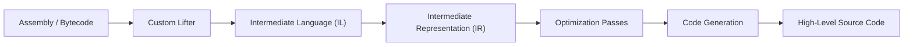

# Luramas

**The Retargetable & Customizable Decompiler Framework**

Luramas is a retargetable decompiler framework made to disassemble, optimize, and lift abstract Virtual Machine/Native CPU bytecode architectures into an analyzable and recompilable state.

By separating target-specific parsing from core semantics, the framework allows you to construct custom frontends (**Lifters**) for arbitrary architectures while reusing a unified optimization pipeline.

***This repository serves as the framework core for Luramas and contains the engine infrastructure.***

## Documentation Hub

To maintain clarity, everything is separated from one another. **If you are new to Luramas, please visit the links below**:

* **[Getting Started & Introduction](https://pidova.github.io/Luramas-Docs/docs/intro)** – High-level architectural overviews, system design, and step-by-step guides for writing custom lifters.

## Roadmap

To track feature releases, target support expansions, and optimization milestones, visit our roadmap:

* **[Development Roadmap](https://pidova.github.io/Luramas-Docs/docs/roadmap)** – Real-time tracking of active milestones, upcoming optimization passes, and expanding lifter support.

## Pipeline

Luramas separates architecture-specific lifting from the core decompilation pipeline, allowing new targets to reuse existing analysis, optimization, and code generation infrastructure.

## Configuring Luramas

Each Luramas build requires a target configuration to define the architecture-specific behavior and supported features.

Detailed configuration instructions can be found in the [Configuration Guide](https://pidova.github.io/Luramas-Docs/docs/configuring).

## Examples

Example projects demonstrating Luramas usage, supported targets, and framework integration can be found in the [Examples](examples/) directory.

Prebuilt CLI releases and usage instructions are available on the [Releases](../../releases) page.