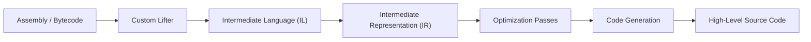

# Luramas

**The Retargetable & Customizable Decompiler Framework**

Luramas is a retargetable decompiler framework made to disassemble, optimize, and lift abstract virtual machines and native CPU architectures into an analyzable and recompilable state.

By separating target-specific parsing from their core semantics, the framework allows you to develop custom frontends (**Lifters**) for arbitrary bytecode while reusing the unified optimization pipeline.

***This repository serves as the framework core for Luramas and contains the engine infrastructure.***

## Documentation Hub

To maintain clarity, everything is separated from one another. **If you are new to Luramas, please visit the links below**:

* **[Getting Started & Introduction](https://pidova.github.io/Luramas-Docs/docs/intro)** - High-level architectural overviews, system design, and step-by-step guides for writing custom lifters.

## Roadmap

To track feature releases, target support expansions, and optimization milestones, visit our roadmap:

* **[Development Roadmap](https://pidova.github.io/Luramas-Docs/docs/roadmap)** - Real-time tracking of active milestones, upcoming optimization passes, and expanding lifter support.

## Pipeline

Luramas separates architecture-specific lifting from the core decompilation pipeline, allowing new targets to reuse existing analysis, optimizations, and code generation.

```mermaid
flowchart LR
    A["Assembly / Bytecode"]
        --> B["Custom Lifter"]
        --> C["Intermediate Language (IL)"]
        --> D["Intermediate Representation (IR)"]
        --> E["Optimization Passes"]
        --> F["Code Generation"]
        --> G["High-Level Source Code"]
```

## Building and Configuring Luramas

Each Luramas build requires a target configuration to define the architecture-specific behavior and supported features.

Detailed building and configuration instructions can be found here: [Building](https://pidova.github.io/Luramas-Docs/docs/Framework/building).

## Scripts

Luramas includes helper python scripts for automating common redundant tasks.

More information and usage examples can be found in the [Py-Scripts](py-scripts/) directory.

## Testing

**Each testing directory contains a corresponding output directory with the output of every test code. There is also a README.md to help with navigating it.**

### Scripts

The **tests/scripts** directory contains sample scripts used for validating the decompiler across supported **interpreted** targets.

- [tests/scripts/lua/](tests/scripts/lua/) - Lua Targets
- [tests/scripts/luau/](tests/scripts/luau/) - LuaU Targets

### Programs

The **test/programs** directory contains sample programs used for validating the decompiler across supported **compiled** targets.
Each test program contains metadata and code-generation in its output more information can be found here: [metadata](https://pidova.github.io/Luramas-Docs/docs/CLI/program-metadata)

- [tests/programs/c](tests/programs/c/) - C Programs
- [tests/programs/cpp](tests/programs/cpp/) - C++ Programs
- [tests/programs/rust](tests/programs/rust/) - Rust Programs

## Examples

Example projects demonstrating Luramas usage, supported targets, and framework integration can be found in the [CLI](CLI/) directory.

Prebuilt CLI releases and usage instructions are available on the [Releases](../../releases) page.